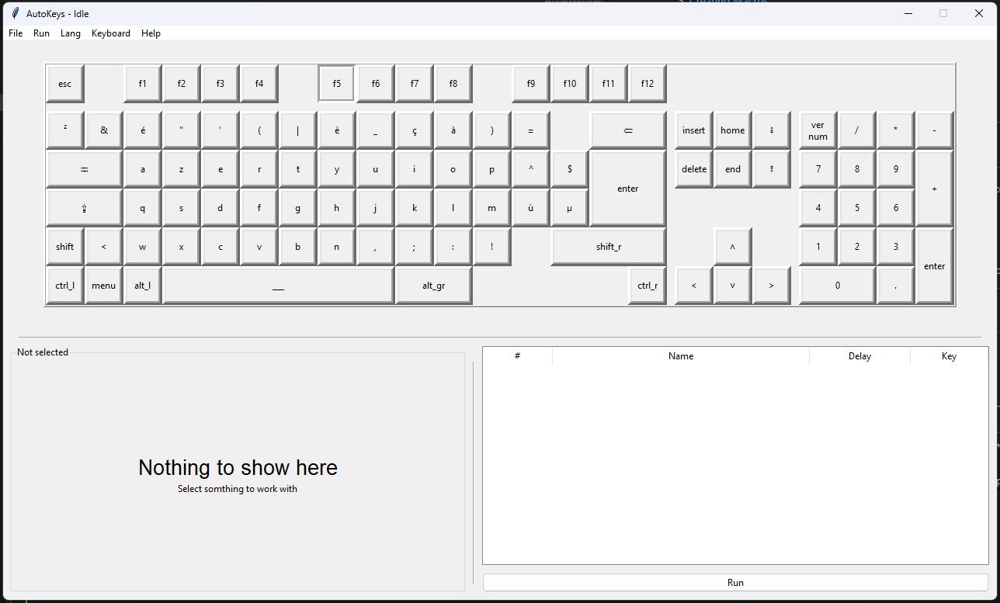
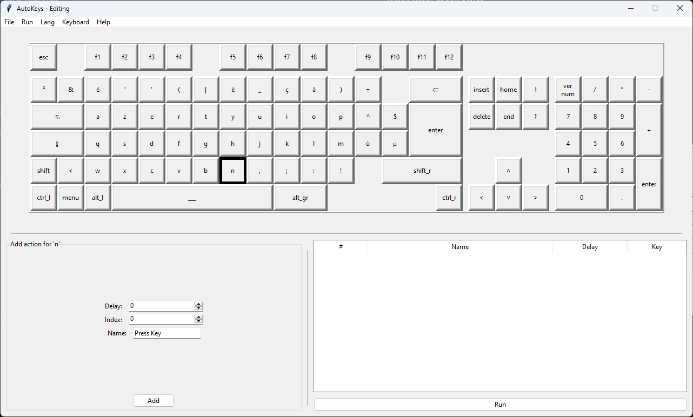

# AutoKeys GUI User Guide

## Table of Contents
1. [Getting Started](#getting-started)
2. [Interface Overview](#interface-overview)
3. [Creating Macros](#creating-macros)
4. [Managing Actions](#managing-actions)
5. [File Operations](#file-operations)
6. [Keyboard Layouts](#keyboard-layouts)
7. [Language Settings](#language-settings)
8. [Keyboard Shortcuts](#keyboard-shortcuts)
9. [Tips & Warnings](#tips--warnings)

---

## Getting Started

AutoKeys is a macro automation tool that allows you to create sequences of keyboard actions. When you launch the application, you'll see:

- A visual keyboard display
- An action list panel on the right
- A configuration panel that changes based on your selection

---

## Interface Overview

### Main Components

| Component | Description |
|-----------|-------------|
| **Visual Keyboard** | Click any key to add it to your macro |
| **Action List** | Displays all actions in your current macro sequence |
| **Configuration Panel** | Changes based on what you're editing |
| **Menu Bar** | File, Run, Language, Keyboard, and Help menus |


---

## Creating Macros

### Adding a Key Action

1. **Click any key** on the visual keyboard
2. In the configuration panel that appears:
   - **Delay**: Time to wait before pressing this key (in milliseconds)
   - **Index**: Position in the sequence (0 = first)
   - **Name**: Give your action a descriptive name
3. Click **"Add"** to insert the action


### Example: Creating a Simple Text Macro

To create a macro that types "Hello":

1. Click the **H** key → Set name "Type H" → Click Add
2. Click the **E** key → Set name "Type E" → Click Add
3. Click the **L** key → Set name "Type L" → Click Add (do this twice)
4. Click the **O** key → Set name "Type O" → Click Add

---

## Managing Actions

### Editing an Action

1. **Select the action** in the action list
2. Modify any of these properties:
   - **Delay**: Change the wait time
   - **Index**: Reposition the action
   - **Name**: Rename the action
3. Click **"Apply"** to save changes


### Editing Multiple Actions

1. **Select multiple actions** (Ctrl+Click or Shift+Click)
2. Set a new delay value
3. Click **"Apply"** to update all selected actions


### Deleting Actions

- **Single action**: Select it and click **"Delete"**
- **Multiple actions**: Select them and click **"Delete"**

### Reordering Actions

Use the **Index** spinner when editing a single action to move it to a different position in the sequence.

---

## Running Macros

### Start a Macro
- Click the **"Run"** button at the bottom right
- Or use **Ctrl+R** keyboard shortcut
- Or use the **Run → Run** menu option

### Stop a Macro
- Click the **"Stop"** button (appears while running)
- Or use **Run → Stop** menu option
- The macro will automatically stop when completed (unless loop is enabled)

### Loop Mode
Enable **Run → Loop** to make the macro repeat continuously until manually stopped.


---

## File Operations

### New Macro
- **Menu:** File → New
- **Shortcut:** Ctrl+N
- Creates a new, empty macro

### Open Macro
- **Menu:** File → Open
- **Shortcut:** Ctrl+O
- Supports `.akd` and `.json` files

### Save Macro
- **Menu:** File → Save
- **Shortcut:** Ctrl+S
- Saves to the current file

### Save As
- **Menu:** File → Save As
- **Shortcut:** Ctrl+Shift+S
- Save to a new file location

---

## Keyboard Layouts

### Built-in Layouts
The application comes with standard layouts like **QWERTY**. Select them from the **Keyboard** menu.

### Importing Custom Layouts

1. Go to **Keyboard → Import**
2. Select one or more JSON layout files
3. The layout will appear in the Keyboard menu

### Layout File Format
```json
{
    "grid": [5, 14],
    "sep": {
        "x": {"4": 20},
        "y": {"0": 20, "1": 20}
    },
    "A": [0, 0, 2, 3],
    "B": [1, 0]
}
```

---

## Language Settings

### Changing Language
1. Go to the **Language** menu
2. Select your preferred language
3. The interface updates immediately

### Adding Languages
Place `.lang` files in:
- `data/autokeys/lang/` (user directory)
- `lang/` (application directory)

---

## Keyboard Shortcuts

| Shortcut | Action |
|----------|--------|
| **Ctrl+N** | New macro |
| **Ctrl+O** | Open macro |
| **Ctrl+S** | Save |
| **Ctrl+Shift+S** | Save As |
| **Ctrl+Q** | Quit |
| **Ctrl+R** | Run/Stop macro |
| **Ctrl+L** | Toggle loop mode |
| **Ctrl+A** | Select all actions |

---

## Tips & Warnings

### ⚠️ Dangerous Macro Warning
If your macro has very short delays (average ≤ 10ms), a warning will appear. This could cause:
- Very rapid key presses
- Potential system instability
- Accidental input flooding

### 💡 Best Practices

1. **Name your actions clearly** - Makes editing easier
2. **Start with longer delays** - 100-500ms is safe for testing
3. **Save frequently** - Ctrl+S is your friend
4. **Test in a text editor first** - Verify your macro works as expected

### 📁 File Locations

| Data Type | Location |
|-----------|----------|
| User Languages | `data/autokeys/lang/` |
| User Layouts | `data/autokeys/layouts/` |
| Configuration | `data/autokeys/config.toml` |

### ❓ Troubleshooting

**Q: My macro isn't running properly**
- Check that delays are long enough for your application to respond
- Verify you're in the correct window when running

**Q: Can't find imported layout**
- Ensure the JSON file has the correct format
- Check the user layouts directory exists

**Q: Language not appearing**
- Verify the `.lang` file is in the correct directory
- Check the file is valid JSON

---

## Support

- **Documentation:** [GitHub Repository](https://github.com/BlankoDev/autokeys)
- **About:** [BlankoDev](https://github.com/BlankoDev)

---

*Happy Automating!* 🚀